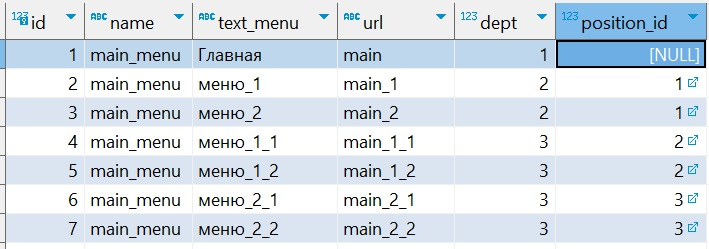

# Древовидное меню для проекта Django

1. Меню реализовано с использование template_tags.
2. Меню храниться и формируется в базе данных, редактирование происходит в административной панели Django.
    


3. Активный пункт меню определяется изходя из текущего URL страницы.
4. На одной странице можно разместить несколько меню
5. При клике на меню осуществяется преход по заданному URL.
6. На отрисовку каждого меню отводиться 1 запрос к базе данных.
7. Все что над выбранным пунктом меню развернуто, первый уровень вложенности под выделенным пунктом меню развернут.


### Установка

*Должен быть установлен Python3.10 и выше, проект реализован на Django 5 версии.*

1. Клонировать репозиторий. 
2. Установить вируальное окружение командой 
```
python3 -m venv venv
```
3. Активировать виртуальное окружение командой (для Unix подобных систем)
```
source venv/bin/activate
```
4. Установить записимости командой
```
pip install -r requirements.txt
```
5. Применить миграции, перейти в папку с проектом и выполнить команды:
```
python3 manage.py makemigrations
python3 manage.py migrate
```

6. Пред использованием необходимо прописать view и url для пунктов меню. [Пример](tree_menu/urls.py)
7. Запустить проект
```
python3 manage.py runserver 
```

Для примера оставляю [базу данных](db.sqlite3) с меню.
